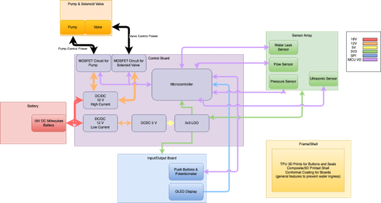
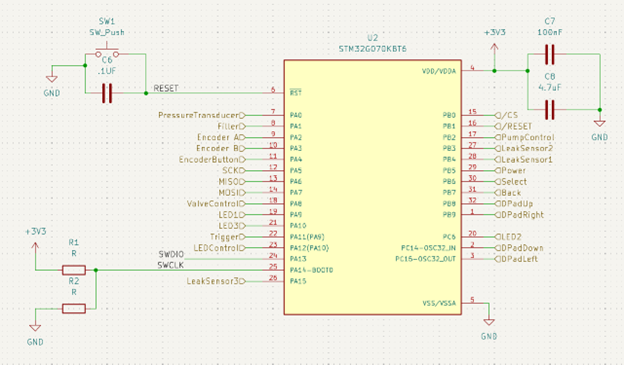
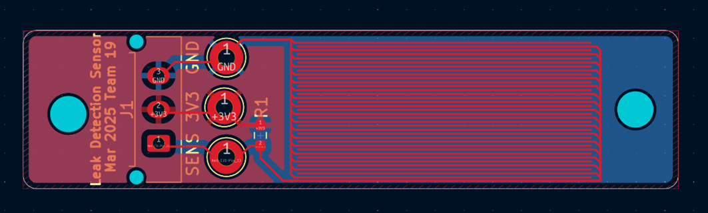

# Lab Notebook

## Project Title: Electric Water Blaster
### Author: Jaejin Lee
### Last Updated: 5/8/2025

---

## Week 5
### **Initial Development/Implementation**
- Developing the first version of the main PCB layout.
- Met with Jack Blevins.

---

## Week 8 - 9
### **PCB Sent Out**
- Finalized PCB layout.
- Reviewed design rules.
- Submitted order.  
- Estimated delivery time: 7 days.

---

## Week 10
### **PCB Assembly**
- Assemble and verify the power stage.
- Soldered components, initial power testing.
- Checked for unexpected voltage fluctuations.

- Assemble control circuitry.
- Assembled and validated key control components.
- Connected power, boot tested firmware.

---

## Week 11
### **PCB Testing**
- Verify power circuits.
- Measured voltage levels, checked stability.
- Stable performance after adjustments.

- Verify control functionality.
- Tested responsiveness and accuracy.
- Checked for signal noise affecting performance.

- Validated MCU operation.
- Uploaded test firmware, verified sensor inputs.

---

## Week 12
### **Firmware Development**
- Implement OLED interface.
- Initialized display, created test graphics.
- Established communication between components. 
- Develop button input handling.

---

## Week 13-15
### **Wrapping Up the Project**
- Evaluate user interface functionality.
- Responsive, requires minor refinements.

- Assemble complete system and validate performance.
- Minor bugs in firmware logic.

- Conduct final verification tests.
- System meets specifications and requirements.

- Resolve outstanding issues.
- Debugged firmware, optimized power consumption.
- Compiled notes, generated final test data.

